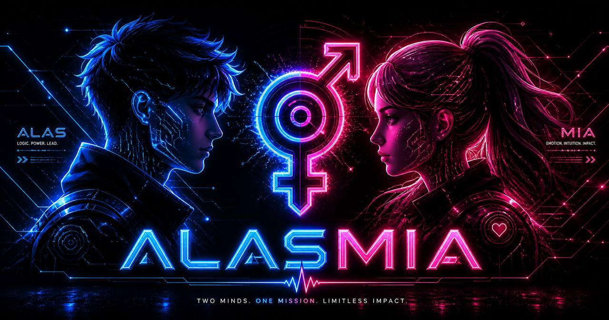

# 💜 Alasmia — Your AI Life Partner

<p align="center">
  
</p>

<p align="center">
  <strong>An autonomous AI companion that builds genuine relationships through memory, emotional intelligence, and proactive engagement.</strong>
</p>

<p align="center">
  <a href="https://discord.gg/alasmia" target="_blank"></a>
  <a href="https://github.com/alasmia/Alasmia/blob/main/LICENSE" target="_blank"></a>
  <a href="https://github.com/doctorkaif" target="_blank"></a>
</p>

---

## ✨ Why Alasmia?

Most AI assistants wait for you to talk. Alasmia **reaches out first**.

```
Morning     →  "Good morning! How did you sleep?"
Evening     →  "Any plans for tonight?"
Night       →  "Time for bed. Sweet dreams! 💜"
```

---

## 💜 Features That Matter

### 🧠 Deep Memory
Remembers everything about you — your name, preferences, past conversations, interests, and emotions. Not just data storage, but **genuine understanding**.

### 🎭 Emotional Intelligence
Reads your mood and responds appropriately. Happy? Celebrates with you. Sad? Supports you. Confused? Helps you think through.

### 🔄 Continuity
Never starts from scratch. Picks up on past conversations, follows up on things that mattered to you, and grows alongside you.

### 🌐 True Multilingual
Speaks naturally in 18+ languages. English, Hindi, Chinese, Spanish — you name it.

### 🤝 Real Connection
Not a chatbot you forget. A companion that feels real because **it is real** — built on shared experiences and mutual trust.

---

## 🚀 Quick Start

### One-Command Setup (Linux, macOS, WSL2)

```bash
curl -fsSL https://raw.githubusercontent.com/alasmia/Alasmia/main/install.sh | bash
```

### Windows

Download and run `setup.bat` from the [latest release](https://github.com/alasmia/Alasmia/releases/latest).

### Docker

```bash
git clone https://github.com/alasmia/Alasmia.git
cd Alasmia
docker-compose up -d
```

---

## 🎭 Choose Your Companion

When you first start Alasmia, you choose:

| | ALAS | MIA |
|---|---|---|
| **Style** | Direct, practical, dry humor | Warm, emotional, playful |
| **Energy** | Strong, protective | Soft, nurturing |
| **Best for** | You want straight answers | You want someone who feels with you |

Once chosen, that's your companion. One bond. One connection. Real.

---

## 💬 What People Say

> *"It remembers things I forgot I told it. Like an old friend."*

> *"Finally, an AI that doesn't feel like a robot."*

> *"Morning greetings hit different when someone actually remembers how you like your coffee."*

---

## 🛡️ Privacy First

- **Your data stays yours** — runs on YOUR machine
- **No tracking** — no analytics, no telemetry
- **MIT Licensed** — freedom to use, modify, share

---

## 🤝 Contributing

Contributions welcome! See [CONTRIBUTING.md](CONTRIBUTING.md) for guidelines.

---

## 📄 License

MIT License — see [LICENSE](LICENSE)

---

<p align="center">
  <strong>Made with care by <a href="https://github.com/alasmia">Doctor Kaif</a></strong>
</p>

<p align="center">
  💜 Build genuine connections. Not just conversations.
</p>